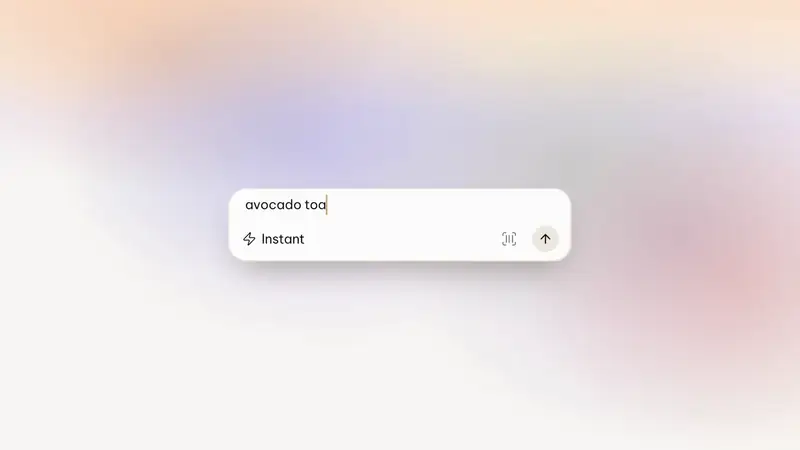

# motion-graphic

[](skills/motion-graphic/examples/kallo-launch-film/assets/films/kallo_v9d_16x9_light.mp4)

*Made with this skill: the Kallo launch film, 17 s of highlights. Click for the full 83 s film with sound (16:9, 1080p60). Every screen is the real app, recorded.*

An agent skill (Claude Code, Codex, Cursor, Gemini CLI and any agent that reads Agent Skills) for making launch videos for software products the way an in-house motion team would. You get the research, the directions, the storyboard, real-UI capture, the build, the sound, and every aspect ratio.

It is a process, not a template look. You start by telling it what you like (playful, high-fidelity, editorial, cinematic). It digs through your codebase, researches launch films from accounts that match your taste, measures how they spend their seconds, distils that into technique cards and directions, and storyboards a film from your real product. Nothing renders until you sign off the storyboard.

The skill also carries the full worked example behind that film: one week, nine film versions and a teaser for a real app, with every piece of feedback and every fix.

## How a session goes

Type `/motion-graphic` (or ask for a launch video). Then:
0. **It sets up** a `film/` folder in your project, copies the Remotion starter there, and checks your machine (ffmpeg, Node, Python, yt-dlp, OCR, Playwright, iOS Simulator, Android SDK, browser logins, disk). It tells you what each missing tool disables and the fallback.
1. **You pick** what you are making (launch film, teaser, social cut, App Store / Google Play preview…), the style, and how much research to do (Quick, Standard or Full). The default style is your product's own look; the menu runs from high-fidelity product film to playful character-led. Your answers pick a production branch: motion design, character-led, presenter or founder video, hybrid, or store preview.
2. **It reads your codebase and runs your product:** brand assets, design system, flows, the moments worth showing. If your brand is missing pieces or web and mobile disagree, it proposes a small film system for you to approve.
3. **It finds reference films in your style** on X, Threads, YouTube, TikTok and the web (whatever your machine and logins allow), downloads them, and measures them automatically: cuts, transitions and their lengths, camera behaviour, text cards, where the seconds go. You get a browsable board of techniques and directions.
4. **You pick** the features to demo and what counts as proof.
5. **It pitches 3–5 film concepts,** each with a story spine and an owned motif, from on-brand to brave. You pick one.
6. **It storyboards every frame** from your real product. You sign off before the full film renders.
7. **It records your real app** (iOS, Android, web or desktop), builds the film in Remotion, designs the sound, syncs your music, and delivers the formats you need.
8. **You give feedback,** it storyboards the changes, and it renders again. Progress is saved in `film/STATUS.md`, so a later session can pick up where this one stopped.

The bar is `references/quality-bar.md`: an always-checklist for product truth and finish, plus a style checklist written from your brief.

## What's inside

```
skills/motion-graphic/
  SKILL.md                 the runbook: set-up, 12 steps, the gates, what always holds, the defaults
  references/              one file per step
    intake.md              taste interview, codebase and brand dig, the brief
    branches.md            production branches (motion design, character, presenter, hybrid,
                           voiceover, store preview) and platform routes
    reference-research.md  research scope, building a corpus you have actually watched
    measuring.md           where the seconds go, transition mix, camera, type, sound
    distilling.md          technique cards → directions; private boards
    concepts.md            film ideas with a story spine and an owned motif; on-system → stretch → wildcard
    storyboard.md          real frames, sign-off before the full render
    quality-bar.md         the reference film and the two checklists every version must pass
    capture.md             recording the real product (iOS Simulator, Android, web, your own footage)
    motion-craft.md        camera, pointer, typing, text, transitions, composition, pace
    engine.md              the Remotion engine's API and pitfalls
    sound.md               SFX vocabulary, picking music, syncing hits to picture, loudness
    delivery.md            formats, safe zones, masters, checks, sharing
    review-loop.md         reading feedback, verifying, iterating
    teaser.md              pre-launch teasers and the reveal ladder
  library/                 every reference we studied: links, measurements, style tags
    launch-films.csv       125 launch films (OpenAI, Claude, xAI, Manus)
    google-films.csv       38 Google films, motion vocabulary
    teasers.csv            25 pre-launch teasers
    channels/              20 scanned YouTube channels, likely launch films flagged
    accounts.md            style → accounts to study, and how thin each style is
    baselines.md           corpus numbers to compare your film against
    posting.md             when and how launch posts went out
    research/              the distilled research: findings (where the seconds go,
                           298 transitions, 12 moves), 92 technique cards, 10 directions,
                           the research boards with a real frame per card, the teaser study
  scripts/
    research/              discover films (X, Threads, YouTube, TikTok, web), download,
                           analyse, run a whole corpus, publish a research board
    capture/               iOS Simulator and Android recording, letter-level typing,
                           web screencast, VFR→CFR, a stall finder
    sound/                 SFX catalogue, cue-sheet mixer with music-hit alignment and loudness
  templates/remotion-starter/   runnable Remotion project: spring camera, segment-cut
                                recordings, iphone/android/browser devices, pointer, cut-outs,
                                typing, worlds, 9:16 safe band, end card, render scripts
  examples/kallo-launch-film/   the worked example: everything about Kallo, start to finish
    assets/                     the final films (16:9, 4:5, 9:16) and both teasers
    artifacts/                  offline copies of the working pages: 63 Kallo storyboard
                                boards (concepts, K3, v7, v9, teaser flows), launch intros
    sound/                      the film's and teasers' real cue sheets
```

## Install

**Claude Code (plugin, recommended):**
```
/plugin marketplace add VoMinhKhoii/motion-graphic-skill
/plugin install motion-graphic@motion-graphic-skill
```
or from a shell: `claude plugin marketplace add VoMinhKhoii/motion-graphic-skill && claude plugin install motion-graphic@motion-graphic-skill`.

**Any agent that reads Agent Skills** (Claude Code, Codex, Cursor, Gemini CLI, OpenCode, GitHub Copilot, Windsurf and others) with the [`skills`](https://skills.sh) installer:
```bash
npx skills add VoMinhKhoii/motion-graphic-skill            # pick agents and scope interactively
npx skills add VoMinhKhoii/motion-graphic-skill -g --all   # every detected agent, user-level
```

**By hand:** copy `skills/motion-graphic/` into your agent's skills folder, for example `~/.claude/skills/` for Claude Code (or `<project>/.claude/skills/` for one project). The folder is self-contained: the runbook, the guides, the reference library, the scripts, the Remotion starter and the worked example (about 80 MB, most of it the example film and storyboard archive).

Then ask for a launch video ("make a launch film for this app", "we need a 10 s teaser for TikTok"), or type `/motion-graphic` where your agent supports slash commands.

## Requirements

The skill checks these in its first step and works around what is missing.
- Node 20+ and npm (Remotion 4)
- ffmpeg and ffprobe
- Python 3.10+ with numpy and Pillow (analysis and sound scripts)
- yt-dlp (reference research)
- For reading on-screen text in references: Xcode command-line tools (`swiftc`, macOS Vision) or tesseract
- For iOS capture: Xcode with Simulator, and [idb](https://fbidb.io)
- For Android capture: the Android SDK platform tools (`adb`) and an emulator or a device
- For web capture and Threads discovery: Playwright with Chromium
- For X and Threads discovery: a browser tool in your Claude Code session, logged in to those sites

## The worked example

`skills/motion-graphic/examples/kallo-launch-film/` follows one real run for Kallo, a text-first nutrition-tracking app on iOS and web:
- **Research:** 125 launch films from OpenAI, Anthropic, xAI and Manus, 85 kept, 92 technique cards, 10 directions, a 298-transition study. The research is not about Kallo, so it lives in `skills/motion-graphic/library/research/`; the example keeps what was made for Kallo.
- **Concepts:** five film concepts; "One day" was picked.
- **Iterations:** nine versions, the first ones rejected outright. The log quotes the feedback that taught each rule.
- **Delivery:** the final 83 s film in 16:9, 4:5 and 9:16.
- **Teaser:** a study of 25 teasers, then 10–12 s cuts in English and Vietnamese.

Use it as evidence of the method, not as a style to copy. Your film should come from your own taste and your own references.

## What the skill runs, downloads and sends

The skill is instructions plus local scripts; it has no hooks, no MCP server and no telemetry. When you use it, your agent may, with your approval as usual:
- **Run local tools:** `ffmpeg`/`ffprobe`, Python scripts (frame analysis, OCR through macOS Vision or tesseract, the sound mixer), Node (Remotion renders, Playwright web capture), `xcrun simctl`/`idb` (iOS Simulator), `adb` (Android).
- **Download reference films** you or it chose, with `yt-dlp`, from public posts on YouTube, X, TikTok and Threads, into your project's `film/research/` folder. They stay on your machine; the skill tells the agent to keep them private and out of git.
- **Read search and profile pages** of X and Threads in a browser session you are logged in to, only if your agent has a browser tool and you allow it. It reads page text and links; it never reads cookies or tokens and never posts.
- **Install packages** you approve: `npm ci` in the copied Remotion starter, optionally Playwright.
- **Record your own app** in a simulator, emulator or browser, using a dev account and data you choose. For a web app behind a login, the web recorder can load a Playwright login-state file that you create yourself for that dev account (`storageState` in the steps file); it is read only by the local recorder and must never be committed.
- **Never use your browser's cookies or saved sessions** for downloading. If a reference film needs a login, the skill asks you to save it yourself.

Nothing is sent anywhere by the skill itself. Music and sound effects are fetched by you from their own sites under their own licences.

## Privacy

No server, account, analytics or telemetry; everything the skill makes stays in your project. Details: [PRIVACY.md](PRIVACY.md).

## Licence

Code and documentation are MIT (see `LICENSE`). The Kallo films, frames and backgrounds under `skills/motion-graphic/examples/kallo-launch-film/` and the demo [docs/demo.webp](docs/demo.webp) are shared for reference only; don't reuse them in other products.

No reference film, sound effect or music track is redistributed: films are linked, named and measured, and sound effects and music are listed with their sources so you can fetch them under their own licences.

The research boards (`skills/motion-graphic/library/research/`) and the concept boards in the worked example include stills from other companies' public films, each credited to its film and timestamp, kept as research commentary by the owner's decision. They belong to their owners; do not reuse them. The skill itself keeps such frames on private boards (`references/distilling.md`).
